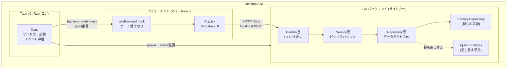
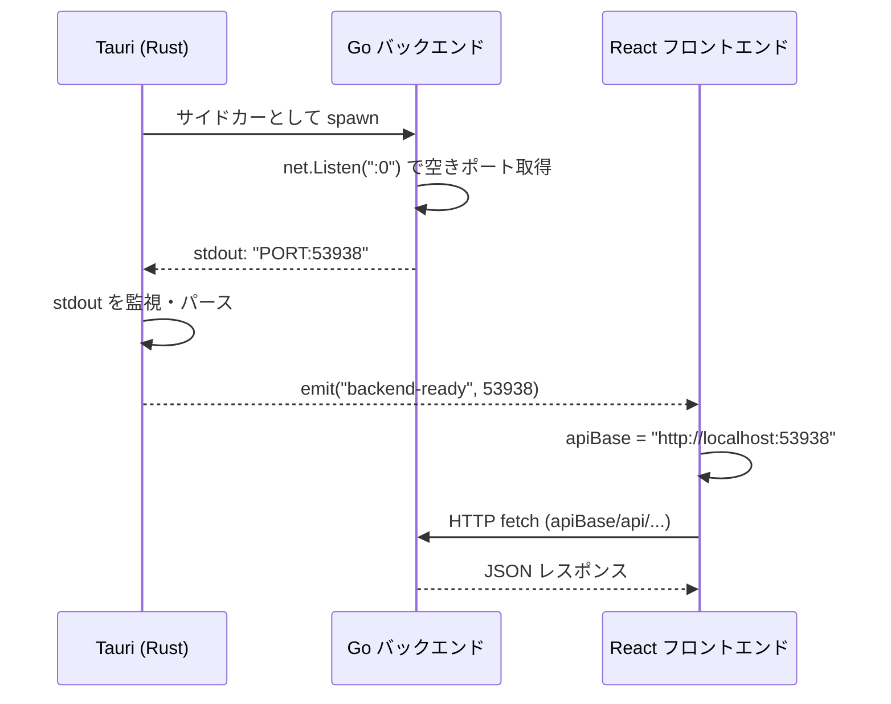
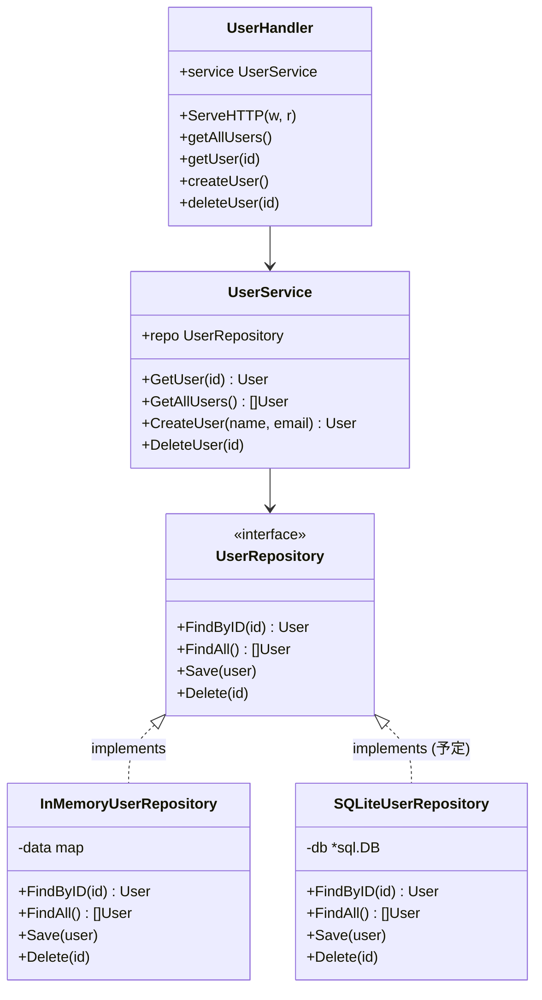
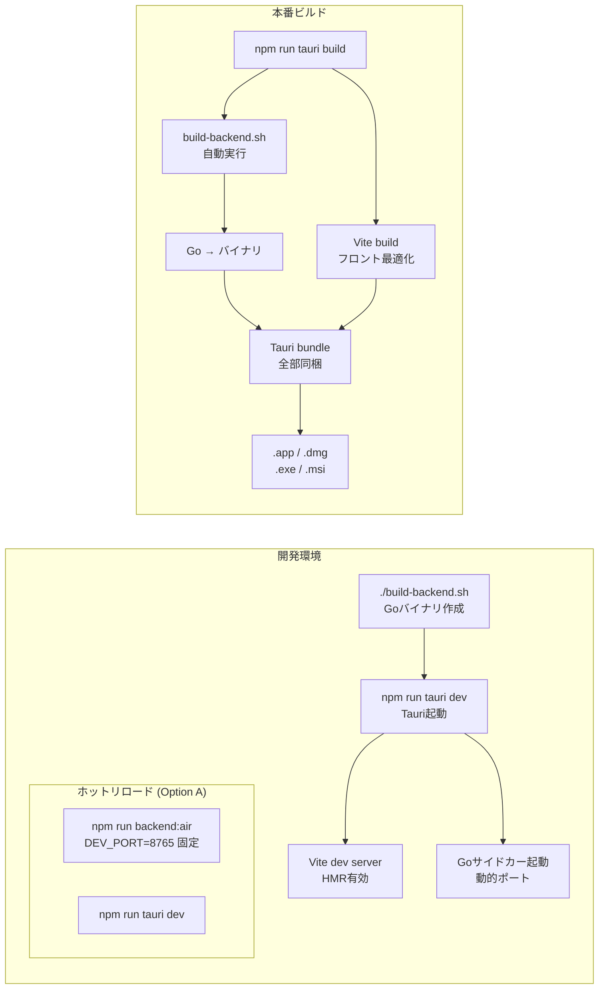

# tauri-app

Tauri + Vite/React + Go のデスクトップアプリテンプレート。

## 技術スタック

| レイヤー | 技術 |
|---|---|
| フロントエンド | Vite + React + TypeScript |
| UIライブラリ | Bootstrap 5 + React-Bootstrap |
| アイコン | FontAwesome (react-fontawesome) |
| デスクトップ基盤 | Tauri v2 (Rust) |
| バックエンド | Go (サイドカー) |
| アーキテクチャ | Handler → Service → Repository |

---

## 全体構成図



---

## ポート検知フロー



---

## Goバックエンド層構造



---

## 開発・本番のフロー比較



---

## ディレクトリ構成

```
tauri-app/
├── src/                          # Vite + React フロントエンド
│   ├── hooks/useBackend.ts       # バックエンドポート受け取りフック
│   └── App.tsx                   # メインUI
├── src-tauri/                    # Tauri (Rust コア)
│   ├── src/lib.rs                # Goサイドカー起動 + ポートをフロントへ送信
│   ├── binaries/                 # ビルド済みGoバイナリ置き場
│   ├── capabilities/default.json # Tauriパーミッション設定
│   ├── tauri.conf.json           # Tauriアプリ設定（共通）
│   └── tauri.windows.conf.json   # Windows用設定上書き（beforeBuildCommand等）
├── backend/                      # Go バックエンド
│   ├── main.go                   # エントリポイント・空きポート検知
│   ├── server.go                 # ルーティング
│   ├── handler/                  # HTTPハンドラー
│   ├── service/                  # ビジネスロジック
│   ├── repository/               # データアクセスインターフェース
│   │   ├── memory/               # インメモリ実装
│   │   └── sqlite/               # SQLite実装
│   ├── infra/db.go               # SQLite接続・マイグレーション
│   ├── model/                    # データ構造体
│   └── .air.toml                 # air（ホットリロード）設定
├── build-backend.sh              # Goビルドスクリプト（macOS/Linux）
└── build-backend.ps1             # Goビルドスクリプト（Windows PowerShell）
```

---

## 設計指針

### 1. レイヤー分離（関心の分離）

各層は隣接する層のインターフェースのみに依存し、具体的な実装に依存しない。

```
Handler  →  Service  →  Repository (interface)
                              ↓
                         InMemoryRepository / SQLiteRepository / ...
```

- **Handler** はHTTPの入出力だけを担う。ビジネスロジックは持たない
- **Service** はビジネスロジックのみ。DBの種類を知らない
- **Repository** はインターフェースで定義。差し替えはmain.goのDI箇所だけ

### 2. DB未定でも開発を進める

`memory.InMemoryRepository` を差し込むことで、DBが決まる前からアプリケーションロジックを開発できる。
DBが決まったら `repository/sqlite/` などを追加し、`main.go` の1行を変えるだけで差し替え完了。

```go
// main.go — ここだけ変える
userRepo := memory.NewUserRepository()
// userRepo := sqlite.NewUserRepository(db)
```

### 3. 動的ポートによるポート衝突回避

本番環境では `net.Listen(":0")` でOSに空きポートを割り当てさせる。
固定ポートにしないことでポート競合が起きない。複数インスタンス起動も安全。

### 4. stdout経由のプロセス間通知

TauriサイドカーはGoプロセスのstdoutを直接読める。
ポート番号を `PORT:xxxxx` 形式でstdoutに出力し、Rustコアがキャッチしてフロントにeventを飛ばす。
HTTPサーバーや共有ファイルを使わないシンプルな起動通知。

### 5. フロントエンドはバックエンドの存在を意識しない

`useBackend` フックがポート受け取りとapiBaseの管理を隠蔽する。
各コンポーネントは `apiBase` を受け取るだけで、Tauriのイベント仕組みを知る必要がない。

### 6. 本番ビルドはコマンド1つ

`npm run tauri build` だけで以下がすべて自動実行される。
- Goバイナリのクロスコンパイル (`build-backend.sh`)
- Viteによるフロントエンドのバンドル
- TauriによるGoバイナリ同梱 + インストーラ生成

---

## セットアップ

### 必要なもの

- [Node.js](https://nodejs.org/) v18+
- [Go](https://go.dev/) v1.21+
- [Rust](https://www.rust-lang.org/) (rustup)
- [air](https://github.com/air-verse/air)（Goホットリロード、任意）: `go install github.com/air-verse/air@latest`

### インストール

```bash
npm install
```

---

## 開発

### 通常起動（Goはサイドカーとして自動起動）

```bash
# Goバイナリをビルド（初回・Go変更時に実行）
./build-backend.sh

# Tauriアプリ起動
npm run tauri dev
```

### Goホットリロードあり（Option A）

Goファイルを変えるたびに自動リビルド・再起動したい場合：

```bash
# ターミナル1: Go（air でホットリロード、固定ポート8765）
npm run backend:air

# ターミナル2: Tauri（Viteフロント + Rustコア）
npm run tauri dev
```

> **Note:** `backend:air` は `DEV_PORT=8765` の固定ポートで起動する。  
> Tauriサイドカーとは別プロセスになるため `backend-ready` イベントは飛ばない。  
> フロントは `http://localhost:8765` に直接fetchすること（開発時の割り切り）。

---

## 本番ビルド

### macOS / Linux

```bash
npm run tauri build
```

- `beforeBuildCommand` が `build-backend.sh` → `npm run build` を自動実行
- 出力先: `src-tauri/target/release/bundle/`
  - macOS: `.app` + `.dmg`

### Windows

```powershell
npm run tauri build
```

- `src-tauri/tauri.windows.conf.json` によって `beforeBuildCommand` が自動的に `pwsh` 経由に切り替わる
- Goバイナリのビルドには PowerShell 7 (`pwsh`) が必要
- 出力先: `src-tauri\target\release\bundle\`
  - `msi\tauri-app_x.x.x_x64_en-US.msi`（MSIインストーラー）
  - `nsis\tauri-app_x.x.x_x64-setup.exe`（NSISセットアップ）

#### Windowsの事前準備

```powershell
# winget で一括インストール
winget install GoLang.Go
winget install Rustlang.Rustup
winget install Microsoft.VisualStudio.2022.BuildTools --override "--add Microsoft.VisualStudio.Workload.VCTools --includeRecommended"

# Rustツールチェーン（Visual Studio経由のMSVCが必要）
rustup toolchain install stable-x86_64-pc-windows-msvc
rustup default stable-x86_64-pc-windows-msvc

# Node.js依存関係インストール
npm install
```

> **注意:** macOS で作成した tar.gz を Windows に転送すると `._*` ファイル（macOSリソースフォーク）が混入することがある。  
> ビルド前に `Get-ChildItem -Recurse -Filter '._*' | Remove-Item -Force` で削除すること。

---

## DBの差し替え方

`backend/repository/` に新しい実装を追加し、`backend/main.go` のDI箇所を変更するだけ：

```go
// main.go
// userRepo := memory.NewUserRepository()   ← 現在
userRepo := sqlite.NewUserRepository(db)    // ← 差し替え後
```
