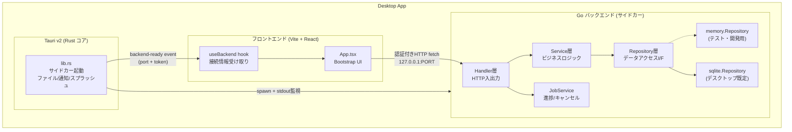
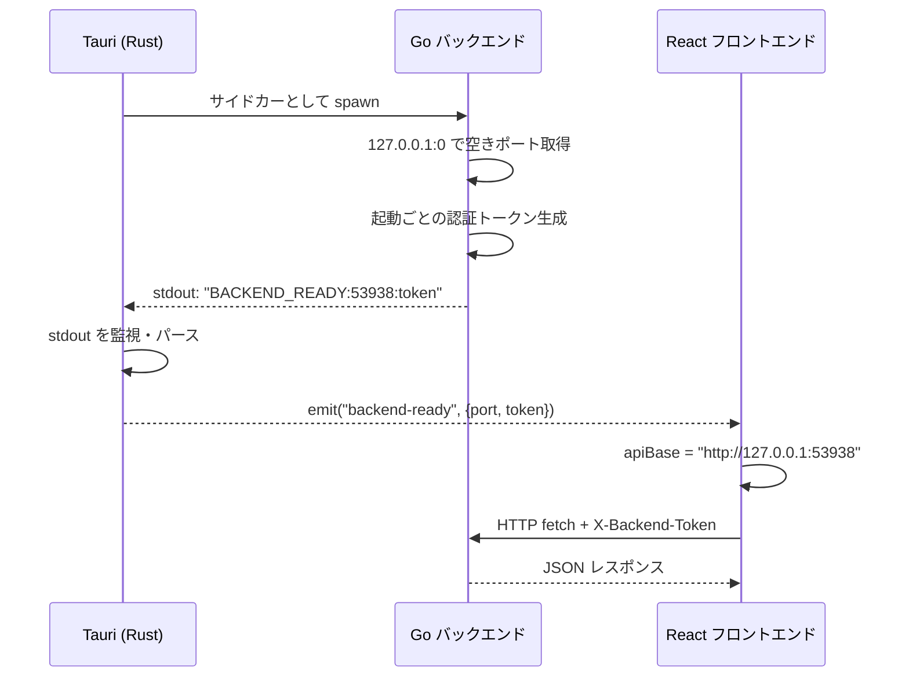
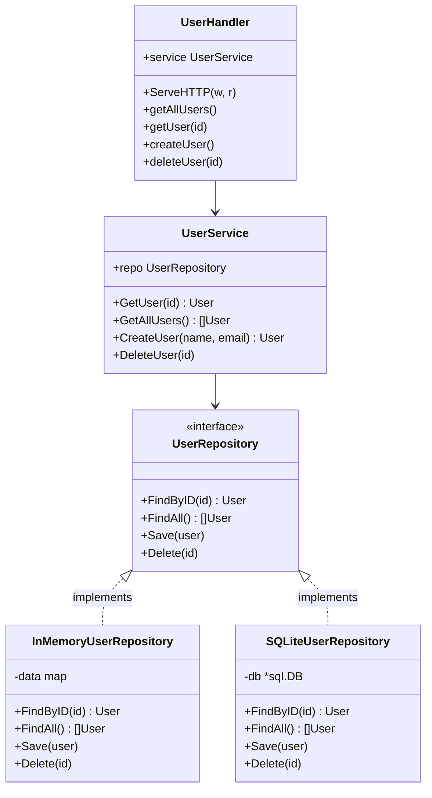
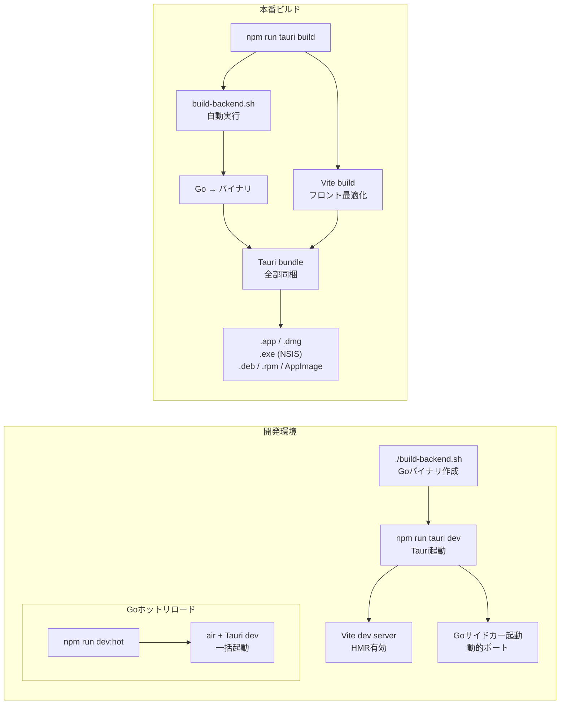

# tauri-app

Tauri + Vite/React + Go のデスクトップアプリテンプレート。

起動後の `Desktop Showcase` では、デスクトップアプリ固有の処理を一連の流れで試せる。

- Rust製ネイティブダイアログ、CSV/JSON選択、ドラッグ＆ドロップ
- Goバックグラウンドジョブ、進捗ポーリング、キャンセル
- Rust製保存ダイアログと、最小化・非表示時のOS通知
- Goバックエンドの準備完了まで表示するスプラッシュウィンドウ（15秒の起動監視付き）

動作確認には `samples/people.csv` と `samples/inventory.json` を利用できる。
macOSではメインWebViewのバックグラウンド停止を無効化し、ウィンドウを隠した後も進捗確認と完了通知が継続する。

`Printer` タブでは次の流れを確認できる。

1. RustがOSのプリンターを列挙し、既定・オフライン状態を表示
2. Goサイドカーが依存ライブラリなしでA4のサンプルPDF帳票を生成
3. React内のPDFプレビュー（この操作では印刷ジョブを投入しない）
4. Rustが選択したOSプリンターへPDFを投入
5. OS印刷キューの処理中・完了・失敗をReactへ反映
6. macOS/Linuxでは、OSキューに残っている間のベストエフォートなキャンセル

WindowsはPDFファイルに登録された `printto` ハンドラーを利用するため、PDFを扱えるアプリ（Microsoft EdgeやAdobe Acrobatなど）が必要。「Microsoft Print to PDF」ではWindowsの保存先ダイアログが表示される。`printto` は投入したスプーラージョブIDを返さず、同じプリンターへ他アプリから投入されたジョブと安全に区別できないため、Windowsではアプリ内キャンセルを提供しない。macOS/LinuxはCUPSの `lp`、`lpstat`、`cancel` を利用し、取得したリクエストIDのジョブだけをキャンセルする。

`QR Reader` タブではUSBシリアル（CDC）型のQR／バーコードリーダーを列挙し、Rustで受信した値をReactへリアルタイム表示できる。候補機器は製品名から自動選択され、ポートの再検出、接続・切断、ボーレート変更、直近100件の履歴表示に対応する。切断時は読み取りスレッドがポートを解放するまで待つため、同じポートへすぐ再接続できる。読み取った内容は自動実行せず文字列としてのみ扱う。

Go側だけで帳票を生成する場合:

```bash
cd backend
go run ./cmd/sample-report ../sample-report.pdf
```

## 技術スタック

| レイヤー | 技術 |
|---|---|
| フロントエンド | Vite + React + TypeScript |
| UIライブラリ | Bootstrap 5 + React-Bootstrap |
| アイコン | FontAwesome (react-fontawesome) |
| デスクトップ基盤 | Tauri v2 (Rust) |
| バックエンド | Go (サイドカー) |
| アーキテクチャ | Handler → Service → Repository |

---

## 全体構成図


```mermaid
graph TB
    subgraph Desktop App
        subgraph Tauri["Tauri v2 (Rust コア)"]
            TauriCore["lib.rs\nサイドカー起動\nファイル/通知/スプラッシュ"]
        end

        subgraph Frontend["フロントエンド (Vite + React)"]
            Hook["useBackend hook\n接続情報受け取り"]
            UI["App.tsx\nBootstrap UI"]
        end

        subgraph GoBackend["Go バックエンド (サイドカー)"]
            Handler["Handler層\nHTTP入出力"]
            Service["Service層\nビジネスロジック"]
            Job["JobService\n進捗/キャンセル"]
            Repository["Repository層\nデータアクセスI/F"]
            MemRepo["memory.Repository\n(テスト・開発用)"]
            DBRepo["sqlite.Repository\n(デスクトップ既定)"]
        end
    end

    TauriCore -->|"spawn + stdout監視"| GoBackend
    TauriCore -->|"backend-ready event\n(port + token)"| Hook
    Hook --> UI
    UI -->|"認証付きHTTP fetch\n127.0.0.1:PORT"| Handler
    Handler --> Service
    Handler --> Job
    Service --> Repository
    Repository -.-> MemRepo
    Repository --> DBRepo
```

---

## ポート検知フロー


```mermaid
sequenceDiagram
    participant T as Tauri (Rust)
    participant G as Go バックエンド
    participant R as React フロントエンド

    T->>G: サイドカーとして spawn
    G->>G: 127.0.0.1:0 で空きポート取得
    G->>G: 起動ごとの認証トークン生成
    G-->>T: stdout: "BACKEND_READY:53938:token"
    T->>T: stdout を監視・パース
    T-->>R: emit("backend-ready", {port, token})
    R->>R: apiBase = "http://127.0.0.1:53938"
    R->>G: HTTP fetch + X-Backend-Token
    G-->>R: JSON レスポンス
```

---

## Goバックエンド層構造


```mermaid
classDiagram
    class UserHandler {
        +service UserService
        +ServeHTTP(w, r)
        +getAllUsers()
        +getUser(id)
        +createUser()
        +deleteUser(id)
    }

    class UserService {
        +repo UserRepository
        +GetUser(id) User
        +GetAllUsers() []User
        +CreateUser(name, email) User
        +DeleteUser(id)
    }

    class UserRepository {
        <<interface>>
        +FindByID(id) User
        +FindAll() []User
        +Save(user)
        +Delete(id)
    }

    class InMemoryUserRepository {
        -data map
        +FindByID(id) User
        +FindAll() []User
        +Save(user)
        +Delete(id)
    }

    class SQLiteUserRepository {
        -db *sql.DB
        +FindByID(id) User
        +FindAll() []User
        +Save(user)
        +Delete(id)
    }

    UserHandler --> UserService
    UserService --> UserRepository
    UserRepository <|.. InMemoryUserRepository : implements
    UserRepository <|.. SQLiteUserRepository : implements
```

---

## 開発・本番のフロー比較


```mermaid
flowchart LR
    subgraph Dev["開発環境"]
        direction TB
        D1["./build-backend.sh\nGoバイナリ作成"] --> D2["npm run tauri dev\nTauri起動"]
        D2 --> D3["Vite dev server\nHMR有効"]
        D2 --> D4["Goサイドカー起動\n動的ポート"]

        subgraph HotReload["Goホットリロード"]
            H1["npm run dev:hot"]
            H1 --> H2["air + Tauri dev\n一括起動"]
        end
    end

    subgraph Prod["本番ビルド"]
        direction TB
        P1["npm run tauri build"] --> P2["build-backend.sh\n自動実行"]
        P2 --> P3["Go → バイナリ"]
        P1 --> P4["Vite build\nフロント最適化"]
        P3 --> P5["Tauri bundle\n全部同梱"]
        P4 --> P5
        P5 --> P6[".app / .dmg\n.exe (NSIS)\n.deb / .rpm / AppImage"]
    end
```

---

## ディレクトリ構成

```
tauri-app/
├── src/                          # Vite + React フロントエンド
│   ├── hooks/useBackend.ts       # バックエンドポート受け取りフック
│   ├── components/DesktopDemo.tsx # ファイル・ジョブのデモUI
│   ├── components/PrinterDemo.tsx # PDFプレビュー・印刷ジョブUI
│   ├── components/QrReaderDemo.tsx # USB QRリーダー・受信履歴UI
│   └── App.tsx                   # 画面切り替え
├── src-tauri/                    # Tauri (Rust コア)
│   ├── src/lib.rs                # Goサイドカー起動 + ポートをフロントへ送信
│   ├── src/printing.rs           # OSプリンター列挙・印刷キュー操作
│   ├── src/qr_reader.rs          # USBシリアル列挙・QR受信イベント
│   ├── binaries/                 # ビルド済みGoバイナリ置き場
│   ├── capabilities/default.json # Tauriパーミッション設定
│   ├── tauri.conf.json           # Tauriアプリ設定（共通）
│   └── tauri.windows.conf.json   # Windows用設定上書き（beforeBuildCommand等）
├── backend/                      # Go バックエンド
│   ├── main.go                   # エントリポイント・空きポート検知
│   ├── server.go                 # ルーティング
│   ├── handler/                  # HTTPハンドラー
│   ├── service/                  # ビジネスロジック
│   ├── repository/               # データアクセスインターフェース
│   │   ├── memory/               # インメモリ実装
│   │   └── sqlite/               # SQLite実装
│   ├── infra/db.go               # SQLite接続・マイグレーション
│   ├── model/                    # データ構造体
│   └── .air.toml                 # air（ホットリロード）設定
├── public/                       # スプラッシュ画面
├── samples/                      # CSV/JSON動作確認データ
├── build-backend.sh              # Goビルドスクリプト（macOS/Linux）
└── build-backend.ps1             # Goビルドスクリプト（Windows PowerShell）
```

---

## 設計指針

### 1. レイヤー分離（関心の分離）

各層は隣接する層のインターフェースのみに依存し、具体的な実装に依存しない。

```
Handler  →  Service  →  Repository (interface)
                              ↓
                         InMemoryRepository / SQLiteRepository / ...
```

- **Handler** はHTTPの入出力だけを担う。ビジネスロジックは持たない
- **Service** はビジネスロジックのみ。DBの種類を知らない
- **Repository** はインターフェースで定義。差し替えはmain.goのDI箇所だけ

### 2. DB未定でも開発を進める

`memory.InMemoryRepository` を差し込むことで、DBなしでもサービスやハンドラーをテストできる。
デスクトップアプリはTauriが `--db` を渡すため、既定ではSQLiteへ永続化する。

```go
// main.go — ここだけ変える
// --db なし（テスト・単体起動）
userRepo := memory.NewUserRepository()
// --db あり（Tauriからの通常起動）
userRepo := sqlite.NewUserRepository(db)
```

### 3. 動的ポートによるポート衝突回避

本番環境では `net.Listen("tcp4", "127.0.0.1:0")` でOSに空きポートを割り当てさせる。
固定ポートにしないことでポート競合が起きない。複数インスタンス起動も安全。

### 4. stdout経由のプロセス間通知

TauriサイドカーはGoプロセスのstdoutを直接読める。
ポート番号と起動ごとの認証トークンを `BACKEND_READY:port:token` 形式でstdoutに出力し、Rustコアがキャッチしてフロントにeventを飛ばす。
HTTPサーバーや共有ファイルを使わないシンプルな起動通知。

### 5. フロントエンドはバックエンドの存在を意識しない

`useBackend` フックが接続情報とバックエンド異常終了を管理する。
APIリクエストは `src/api.ts` が認証ヘッダー、HTTPエラー、JSON処理を共通化する。

### 6. ローカルAPIの防御

- 待ち受けは `127.0.0.1` のみに限定
- 起動ごとのランダムトークンを全APIで検証
- CORSはTauriとローカル開発用originだけを許可
- リクエストサイズ、JSON形式、入力値、HTTPタイムアウトを検証
- TauriのCSPを有効化し、フロントエンドのshell権限を付与しない

### 7. 本番ビルドはコマンド1つ

`npm run tauri build` だけで以下がすべて自動実行される。
- Tauriターゲットに対応したGoバイナリのビルド (`build-backend.sh` / `build-backend.ps1`)
- Viteによるフロントエンドのバンドル
- TauriによるGoバイナリ同梱 + インストーラ生成

---

## セットアップ

### 必要なもの

- [Node.js](https://nodejs.org/) v20.19+ または v22.12+
- [Go](https://go.dev/) v1.25+
- [Rust](https://www.rust-lang.org/) (rustup)
- [air](https://github.com/air-verse/air)（Goホットリロード、任意）: `go install github.com/air-verse/air@v1.66.0`

### インストール

```bash
npm install
```

---

## 開発

### 通常起動（Goはサイドカーとして自動起動）

```bash
# Goバイナリをビルド（初回・Go変更時に実行）
./build-backend.sh

# Tauriアプリ起動
npm run tauri dev
```

### Goホットリロードあり

Goファイルを変えるたびに自動リビルド・再起動したい場合：

```bash
npm run dev:hot
```

`air` と Tauri dev を一括起動し、開発専用の固定ポートとトークンを両方へ渡す。
本番ビルドのTauri側は `TAURI_EXTERNAL_BACKEND_*` を無視し、必ず同梱サイドカーを使う。
Windowsではスクリプトが `cmd.exe` 経由で `npm.cmd` を起動するため、PowerShellの実行ポリシーに依存しない。

### ローカル検証

GitHub Actionsを使わずに、主要な変更を次のコマンドで確認できる。

```bash
# Go（macOS/Linuxではrace detectorも利用可能）
cd backend
go test -race ./...
cd ..

# Rust
cargo test --manifest-path src-tauri/Cargo.toml
cargo clippy --manifest-path src-tauri/Cargo.toml --all-targets -- -D warnings

# React / TypeScript
npm run build
```

WindowsでCGOを無効にしている場合は `go test ./...` を利用する。

---

## 本番ビルド

### macOS / Linux

```bash
npm run tauri build
```

- `beforeBuildCommand` が `build-backend.sh` → `npm run build` を自動実行
- 出力先: `src-tauri/target/release/bundle/`
  - macOS: `.app` + `.dmg`

### Windows

```powershell
npm run tauri build
```

- `src-tauri/tauri.windows.conf.json` によって `beforeBuildCommand` が自動的に `pwsh` 経由に切り替わる
- Goバイナリのビルドには PowerShell 7 (`pwsh`) が必要
- 出力先: `src-tauri\target\release\bundle\`
  - `nsis\tauri-app_x.x.x_x64-setup.exe`（NSISセットアップ）

#### Windowsの事前準備

```powershell
# winget で一括インストール
winget install GoLang.Go
winget install Rustlang.Rustup
winget install Microsoft.VisualStudio.2022.BuildTools --override "--add Microsoft.VisualStudio.Workload.VCTools --includeRecommended"

# Rustツールチェーン（Visual Studio経由のMSVCが必要）
rustup toolchain install stable-x86_64-pc-windows-msvc
rustup default stable-x86_64-pc-windows-msvc

# Node.js依存関係インストール
npm install
```

> **注意:** macOS で作成した tar.gz を Windows に転送すると `._*` ファイル（macOSリソースフォーク）が混入することがある。  
> ビルド前に `Get-ChildItem -Recurse -Filter '._*' | Remove-Item -Force` で削除すること。

---

## Windows インストーラ (NSIS) のカスタマイズ

本テンプレートは Windows 配布を **NSIS のみ** にしている (理由は [CLAUDE.md ハマりどころ #1](CLAUDE.md))。
NSIS でも下記のような典型カスタマイズはほぼ全て対応可能。

### 1. ライセンス規約 (EULA) を表示

`tauri.conf.json` の `bundle.windows.nsis.license` に EULA ファイルを指定するだけで、
MUI License Page が標準で挿入される (同意しないと次へ進めない動作付き)。

```jsonc
"bundle": {
  "windows": {
    "nsis": {
      "license": "license/EULA.txt"   // .txt / .rtf 両対応
    }
  }
}
```

### 2. プロダクトキー入力 (カスタムページ)

Tauri 標準の組込みページには無いが、NSIS の `nsDialogs` でカスタムページを
差し込めば実現できる。Tauri は `bundle.windows.nsis.template` で
カスタム NSIS スクリプト (`.nsi`) を丸ごと差し替え可能。

骨子:

```nsis
; installer-templates/installer.nsi
!include "nsDialogs.nsh"
!include "MUI2.nsh"

!insertmacro MUI_PAGE_LICENSE "license/EULA.txt"
Page custom ProductKeyPage ProductKeyLeave
!insertmacro MUI_PAGE_DIRECTORY
!insertmacro MUI_PAGE_INSTFILES

Var ProductKey
Function ProductKeyPage
  nsDialogs::Create 1018
  ${NSD_CreateLabel} 0 0 100% 12u "プロダクトキーを入力してください:"
  ${NSD_CreateText}  0 20u 100% 12u ""
  Pop $ProductKey
  nsDialogs::Show
FunctionEnd
Function ProductKeyLeave
  ${NSD_GetText} $ProductKey $0
  ; 形式バリデート / オンライン認証 / レジストリ書込み 等をここで
  WriteRegStr HKCU "Software\${PRODUCTNAME}" "ProductKey" "$0"
FunctionEnd
```

```jsonc
"bundle": {
  "windows": {
    "nsis": {
      "template": "installer-templates/installer.nsi",
      "license":  "license/EULA.txt"
    }
  }
}
```

ベースは Tauri リポの
[`tooling/bundler/src/bundle/windows/templates/installer.nsi`](https://github.com/tauri-apps/tauri/blob/dev/crates/tauri-bundler/src/bundle/windows/nsis/templates/installer.nsi)
をコピーして `Page custom` を足すのが楽。

### 3. その他のカスタマイズ可能項目

`bundle.windows.nsis` 配下で指定できる主な項目:

| 用途 | 設定キー |
|---|---|
| インストーラアイコン | `installerIcon` |
| 上部バナー / サイド画像 (MUI) | `headerImage` / `sidebarImage` |
| Per-user / Per-machine 切替 | `installMode` (`currentUser` / `perMachine` / `both`) |
| インストール前後フック (NSIS マクロ差込) | `installerHooks` |
| 言語選択ダイアログを出す | `displayLanguageSelector: true` |
| 多言語ローカライズ (.nlf 差し替え) | `customLanguageFiles` |
| 圧縮方式 | `compression` (`none` / `zlib` / `bzip2` / `lzma`) |

公式リファレンス: [Tauri v2 Windows Bundle - NSIS](https://v2.tauri.app/distribute/windows-installer/#nsis)

### 4. MSI が必要になった場合

GPO 配布 / `.msp` パッチ配布 / 企業展開要件などで MSI が必要なケースは、
`productName` を ASCII に保ったうえで `bundle.targets` に `"msi"` を追加する。
NSIS と MSI は同時生成可能だが、productName が非 ASCII だと WiX (`light.exe`)
が落ちるので注意。

```jsonc
"bundle": {
  "targets": ["nsis", "msi", "deb", "appimage", "rpm", "app", "dmg"]
}
```

---

## DBの差し替え方

`backend/repository/` に新しい実装を追加し、`backend/main.go` のDI箇所を変更するだけ：

```go
// main.go の buildUserService
// Tauriからは --db が渡るためSQLiteが既定
return service.NewUserService(sqlite.NewUserRepository(db)), nil
```
